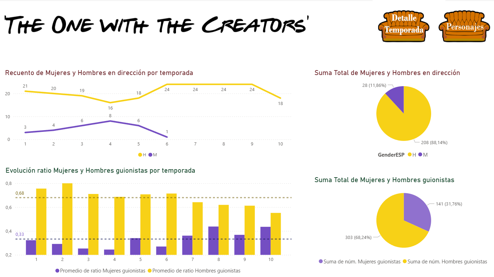

# Friends – Análisis de la Brecha de Género (Power BI)

## 📊 Descripción del Proyecto
Este proyecto consiste en el **análisis y visualización de datos de la serie Friends** utilizando **Power BI**.  
Fue desarrollado como parte de un **Bootcamp de Data Analytics**, con un enfoque específico en el **análisis de la brecha de género en la participación** dentro de la serie.

El estudio se centra en la representación de hombres y mujeres en:
- Guionistas
- Directores y directoras
- Personajes principales
- Personajes secundarios

## 📸 Power BI
A continuación se muestra una vista previa de uno de los dashboards del proyecto:

[](Friends_GenderGap_Analysis.pbix)

🔗 **Haz clic en la imagen para descargar y explorar el dashboard interactivo en Power BI**


## 🎯 Objetivos
Los principales objetivos del proyecto son:
- Analizar las diferencias de participación entre hombres y mujeres en roles creativos.
- Comparar la representación de género entre personajes principales y secundarios.
- Visualizar la brecha de género de forma clara e interactiva.
- Aplicar buenas prácticas de análisis y visualización de datos.

## 🛠️ Herramientas y Tecnologías
- **Power BI** – Modelado de datos y creación de dashboards interactivos  
- **Power Query** – Limpieza y transformación de datos  
- **DAX** – Creación de medidas y métricas calculadas
- **Python (Jupyter Notebook)** – Extracción e inferencia del sexo a partir de nombres mediante un análisis automatizado (.ipynb)  
- **Conceptos de Data Analytics** – Análisis descriptivo y visualización de datos  

## 📈 Dashboards y Análisis
El informe de Power BI incluye:
- Distribución por sexo de guionistas.
- Distribución por sexo de directores y directoras.
- Participación de personajes principales según sexo.
- Participación de personajes secundarios según sexo.
- Visualizaciones comparativas para identificar la brecha de género.
- Filtros interactivos para explorar los datos.

## 📂 Estructura del Repositorio
```python
├── data/ # Datasets utilizados en el proyecto
├── images/
├── notebooks/ # Notebooks de análisis complementario
├── Friends_GenderGap_Analysis.pbix
├── README.md
```

## 🧠 Metodología
Antes de la visualización en Power BI, se utilizó un **notebook en Python** para enriquecer el dataset.  
A partir de los nombres de guionistas, directores y personajes, se realizó una **inferencia del sexo** mediante técnicas automatizadas, permitiendo posteriormente el análisis de la brecha de género en Power BI.

## 📌 Enfoque Analítico y Narrativo del Proyecto
Este proyecto se concibe como un ejercicio de **auditoría cultural y consultoría social**, orientado a analizar cómo el audiovisual contribuye a moldear nuestra percepción de la realidad.

El estudio toma como punto de partida la serie *Friends*, fenómeno cultural de los años 90, con la intención de analizar la **representación de género en la ficción y en los equipos creativos**, y sentar las bases para futuros análisis comparativos en décadas posteriores (2000, 2010 y 2020).

### Inspiración metodológica
El análisis se inspira en la filosofía del **Test de Bechdel**, adoptando su enfoque crítico para evaluar no solo la presencia de mujeres, sino también la **autonomía de su voz y su peso narrativo**.  
Aunque el dataset es cuantitativo, el objetivo es ir más allá del recuento de intervenciones y analizar **quién articula realmente la narrativa**.

### Análisis en pantalla
- Se trabajó sobre más de **60.000 líneas de guión**, depuradas hasta un corpus neto centrado en los seis protagonistas.
- Los datos muestran una **participación muy equilibrada por género** (49% mujeres vs. 51% hombres), constante a lo largo de las diez temporadas.
- El análisis de palabras revela que, aunque el número de líneas es similar, las mujeres tienden a tener **intervenciones más densas y estructuradas**, lo que indica mayor peso narrativo.
- Mediante lógica de negocio en DAX, se clasificaron los diálogos por temas, observándose que los personajes femeninos lideran los principales ejes narrativos.
- El uso del espacio (sets públicos y privados) muestra una ocupación sorprendentemente equitativa para una producción de los años 90.

### Detrás de las cámaras
Al analizar los equipos creativos, los datos revelan una **brecha de género significativa**:
- La dirección de los episodios es mayoritariamente masculina.
- La presencia femenina en guion es mayor, pero sigue siendo minoritaria.
Este contraste evidencia que la igualdad representada en pantalla no se traducía necesariamente en igualdad de oportunidades laborales en la industria audiovisual de la época.

### Análisis exploratorio de emociones
Como línea experimental, se desarrolló un dashboard que analiza las **emociones predominantes por capítulo**, cruzándolas con la composición del equipo de guion.  
Este módulo se presenta como un **prototipo analítico**, orientado a futuros desarrollos más profundos sobre la legitimación emocional en la ficción.

### Personajes secundarios y diversidad
El proyecto amplía el foco hacia los personajes secundarios, entendidos como un indicador clave de la diversidad real del universo narrativo.  
Su análisis permite observar patrones de género en participación y abre nuevas líneas de investigación.

## 🔮 Next Steps
- Análisis emocional detallado de personajes secundarios.
- Estudio temático de los diálogos secundarios.
- Auditoría de género en otros departamentos técnicos.
- Análisis de la representación racial en el universo de la serie.

Este proyecto parte de la premisa de que **la representación no es solo una cuestión de cifras, sino de qué historias se cuentan, quién las cuenta y qué emociones se validan en pantalla**.


## 🚀 Cómo usar el proyecto
1. Descargar el archivo `.pbix`.
2. Abrirlo con **Power BI Desktop**.
3. Explorar los dashboards utilizando filtros y segmentaciones.

## 🎓 Contexto
Proyecto realizado durante el **Bootcamp de Data Analytics & IA** de Adalab, integrando limpieza de datos, análisis y visualización para comunicar insights de forma efectiva.

## 👤 Autoras
- **Gisela Barroso Guerrero** 
- **Andrea R. Virgós**   